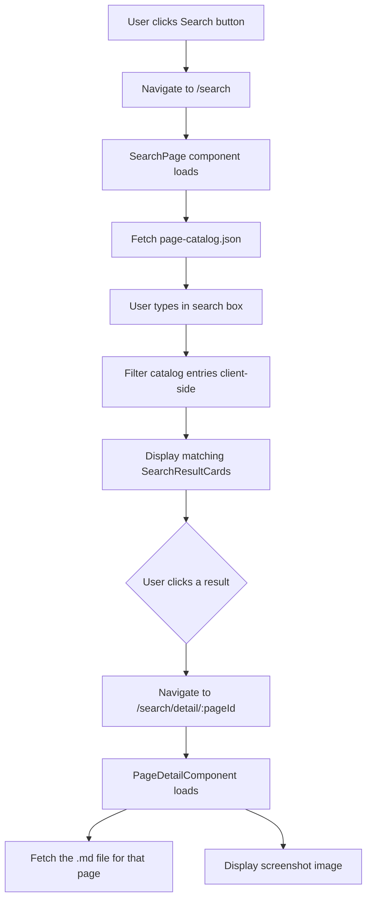

# Search Feature — App & Page Discovery

> **Status:** ✅ Implemented — all components, routes, tests, and assets are in place.

## Overview

A search feature in the Atlas shell that allows users to discover functionality across all MFE apps, even those they don't have access to. Users click a search button next to `ibg\user` in the side menu, which navigates to a search page. As they type, results are filtered from a static JSON catalog containing metadata about every app and page.

## Architecture



## Data Model

### page-catalog.json

A static JSON file served from `apps/atlas/public/page-catalog.json`. Each entry describes one page within an MFE app:

```json
[
  {
    "id": "dashboard-overview",
    "app": "Dashboard",
    "appRoute": "/front-office/dashboard",
    "page": "Overview",
    "pageRoute": "/front-office/dashboard/overview",
    "description": "High-level summary of key metrics, KPIs, and portfolio performance across all trading desks.",
    "keywords": ["metrics", "KPI", "portfolio", "performance", "summary"],
    "docPath": "assets/pages/dashboard/overview.md",
    "imagePath": "assets/pages/dashboard/overview.png"
  }
]
```

| Field | Type | Description |
|---|---|---|
| `id` | `string` | Unique identifier for the page |
| `app` | `string` | Display name of the MFE app |
| `appRoute` | `string` | Route to the app in the shell |
| `page` | `string` | Display name of the page |
| `pageRoute` | `string` | Full route to the page |
| `description` | `string` | Short description of what the page does |
| `keywords` | `string[]` | Searchable keywords for better matching |
| `docPath` | `string` | Path to the markdown documentation file |
| `imagePath` | `string` | Path to the screenshot/preview image |

### Search matching

The search will match against:
- `app` name
- `page` name
- `description` text
- `keywords` array

All matching is case-insensitive and supports partial matches. The search input is debounced to avoid excessive filtering.

## File Structure

```
apps/atlas/
├── public/
│   ├── page-catalog.json                    ← catalog of all pages
│   └── assets/
│       └── pages/
│           ├── dashboard/
│           │   ├── overview.md              ← page documentation
│           │   ├── overview.png             ← page screenshot
│           │   ├── analytics.md
│           │   ├── analytics.png
│           │   ├── reports.md
│           │   └── reports.png
│           ├── settings/
│           │   ├── general.md
│           │   ├── general.png
│           │   ├── profile.md
│           │   └── profile.png
│           └── stocks/
│               ├── summary.md
│               ├── summary.png
│               ├── breakdown.md
│               └── breakdown.png
└── src/app/
    └── pages/
        └── search/
            ├── search-page.ts               ← main search page component
            ├── search-page.spec.ts           ← tests
            ├── search-result-card.ts         ← result card presenter
            ├── page-detail.ts               ← detail view showing .md + image
            └── search.models.ts             ← PageCatalogEntry interface
```

## Components

### 1. Search Button — in SideMenu user bar

Add a 🔍 search button next to `ibg\user` in the side menu user bar. Clicking it navigates to `/search`.

**Location:** [`apps/atlas/src/app/layout/side-menu/side-menu.ts`](../apps/atlas/src/app/layout/side-menu/side-menu.ts:31)

```html
<div class="side-menu__user-bar">
  <span class="side-menu__username">ibg\user</span>
  <a class="side-menu__search-btn" routerLink="/search" aria-label="Search pages">
    🔍
  </a>
</div>
```

### 2. SearchPage component

The main search page with a text input and filtered results grid.

**Route:** `/search`

**Behavior:**
- On load, fetches `page-catalog.json` using `HttpClientData.get()`
- Displays a prominent search text input
- As user types, filters the catalog entries client-side
- Shows results as cards in a responsive grid
- Each card shows: app name, page name, description, and thumbnail image
- Clicking a card navigates to `/search/detail/:pageId`

### 3. SearchResultCard component

A presentational component that displays a single search result.

**Inputs:**
- `entry: PageCatalogEntry` — the catalog entry to display

**Display:**
- App name badge
- Page name as title
- Description text
- Thumbnail image
- Visual indicator if the page route exists in the user's menu

### 4. PageDetail component

Shows the full documentation for a selected page.

**Route:** `/search/detail/:pageId`

**Behavior:**
- Looks up the page entry from the catalog by `id`
- Fetches the `.md` file from `docPath`
- Renders the markdown content as HTML
- Displays the page screenshot from `imagePath`
- Provides a back button to return to search results
- Provides a link to navigate to the actual page if the user has access

## Routes

Add to [`apps/atlas/src/app/app.routes.ts`](../apps/atlas/src/app/app.routes.ts):

```ts
{
  path: 'search',
  data: { breadcrumb: 'Search' },
  children: [
    {
      path: '',
      loadComponent: () => import('./pages/search/search-page').then(m => m.SearchPage),
    },
    {
      path: 'detail/:pageId',
      loadComponent: () => import('./pages/search/page-detail').then(m => m.PageDetail),
      data: { breadcrumb: 'Page Detail' },
    },
  ],
},
```

## Search Algorithm

Simple client-side filtering:

```ts
function filterCatalog(entries: PageCatalogEntry[], query: string): PageCatalogEntry[] {
  const q = query.toLowerCase().trim();
  if (!q) return entries;

  return entries.filter(entry =>
    entry.app.toLowerCase().includes(q) ||
    entry.page.toLowerCase().includes(q) ||
    entry.description.toLowerCase().includes(q) ||
    entry.keywords.some(k => k.toLowerCase().includes(q))
  );
}
```

## Markdown Rendering

For rendering `.md` files as HTML in the PageDetail component, we have two options:

1. **Simple approach:** Fetch the `.md` file as text and display it in a `<pre>` block with basic styling
2. **Rich approach:** Use a lightweight markdown-to-HTML library like `marked` or `showdown`

**Recommendation:** Use the simple approach first — fetch as text and render with basic formatting. This avoids adding a new dependency. The `.md` files are primarily for reading, not for complex rendering.

## Key Design Decisions

| Decision | Rationale |
|---|---|
| **Static JSON catalog** | No backend needed; easy to maintain; works offline |
| **Client-side search** | Catalog is small enough; instant results; no API calls |
| **Files in `public/` directory** | Served as static assets; no build step needed; easy to update |
| **Separate detail page** | Keeps the search results page clean; allows deep-linking to specific page docs |
| **Search button in user bar** | Visible but not intrusive; next to user identity as requested |
| **Shell-only feature** | Search page lives in the shell, not in any MFE; accessible to all users |
